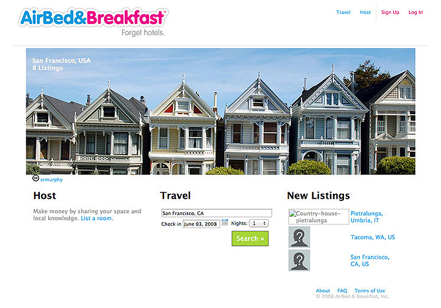
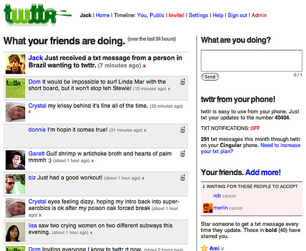
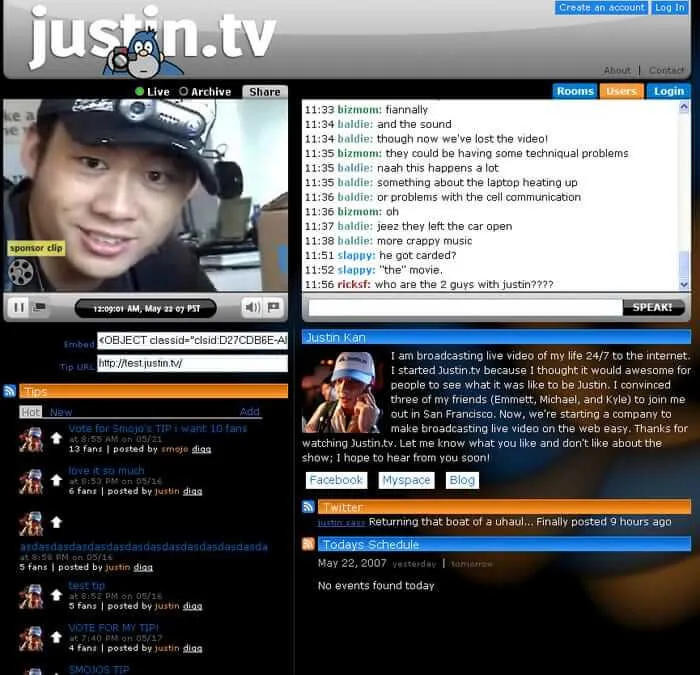
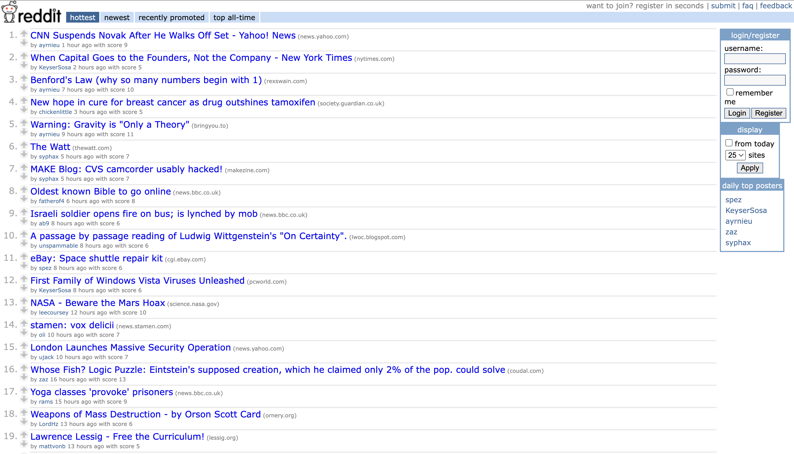

# Keep it simple

---

- The first step towards implementing a full product is eliminating the biggest unknowns with small, experimental, proofs of concept.

---

# The big questions often include:
- Where is the required information coming from?
    - Are our users supplying it?
    - Is it available from an API?
    - Can we download a CSV from a government website?
    - Can we scrape a website for it?
- Is our domain model correct?
    - Did we identify all of the information we need to store to solve the problem?
    - Is our database architecture correct — i.e. are our tables and columns sufficient to store the information?
- Are we solving the right problem, or is an adjacent one more pressing?

---

- We usually throw away the code from 3 or 4 of these small experiments before we build out anything resembling the first real product.

---

- So, keep it simple!

- Don't complicate the codebase by planning 6 months worth of features ahead. What's the smallest thing you can build right now that will allow you to test one assumption?

---

- Chat with us during office hours to help select an idea (hopefully from among a handful) and scope it down to a good initial feature set.

---

- Let's check out what the initial launches of some famous startups looked like.

---

<!-- # Airbnb -->

<!-- 
- Brian/Joe couldn't afford rent
- took a few pictures of their loft, created a web page and had 3 paying guests for a convention.
- pivotted to roommate matching
- only air beds!
- only conventions
 -->

---

<!-- # Twitter -->

<!-- 

- original Twitter prototype was designed for internal users at Odeo as a way to send messages to other employees and view them on a group level.

 -->

---

<!-- # Facebook -->

<!-- 
- originally created the application as a universal directory (or facebook, as it is known at Harvard) for students at Harvard University

- previously created facemash and a study guide app he used to pass his Art History class
- re-used the code from these apps to create facebook

 -->

---

<!-- # Instagram -->

<!-- 
- Instagram’s predecessor, Burbn, was initially designed to allow users to check-in and share their experiences at various locations with friends.

- The initial app, in Kevin Systrom's words, “felt cluttered and overrun with features”. Adoption was poor, and users found the app confusing.

- one feature, however, that users loved. Easy photo-sharing. 

- So Systrom made a tough choice. He took the Burbn MVP and completely overhauled it:
We went out on a limb, and basically cut everything in the Burbn app except for its photo, comment, and like capabilities. What remained was Instagram.

 -->

 ---

<!-- # Amazon -->

<!-- 
- just books
 -->

---

<!-- # Twitch -->

<!-- 
- originally called a justin.tv a livestream of Justin's life
- just 1 channel

 -->

---

<!-- # Reddit -->

<!-- 

- created a bunch of fake users and commented on each other's posts

- just users, posts, votes

 -->

 ---

 # Summary
 - Keep it simple
 - Launch
    - Do people want this?
 - Iterate
